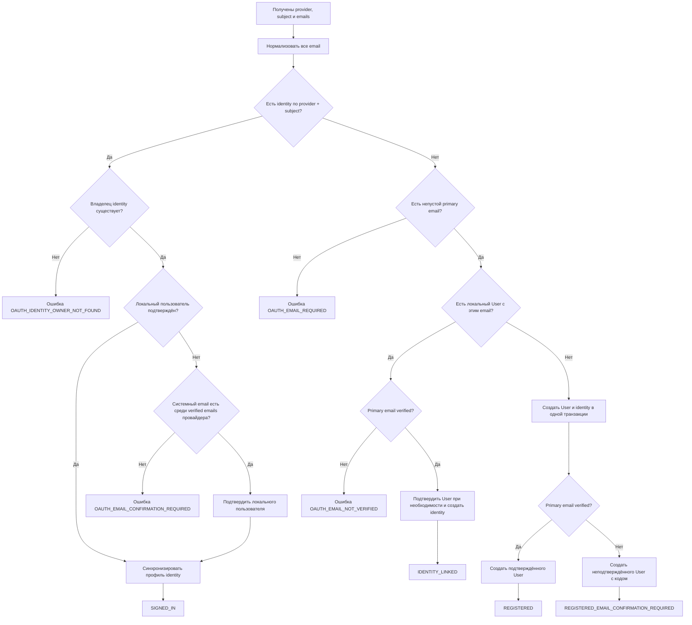
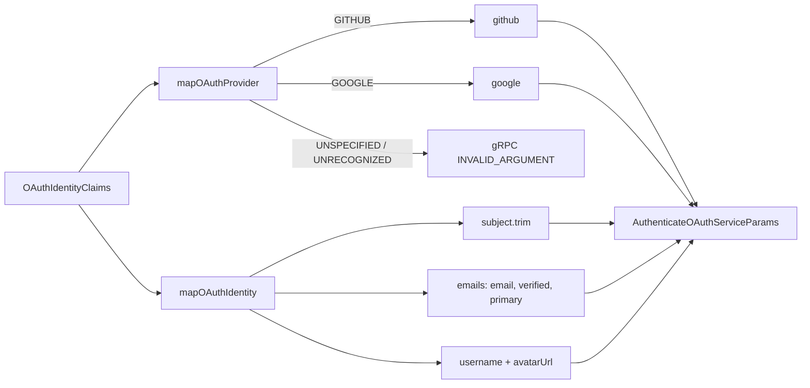
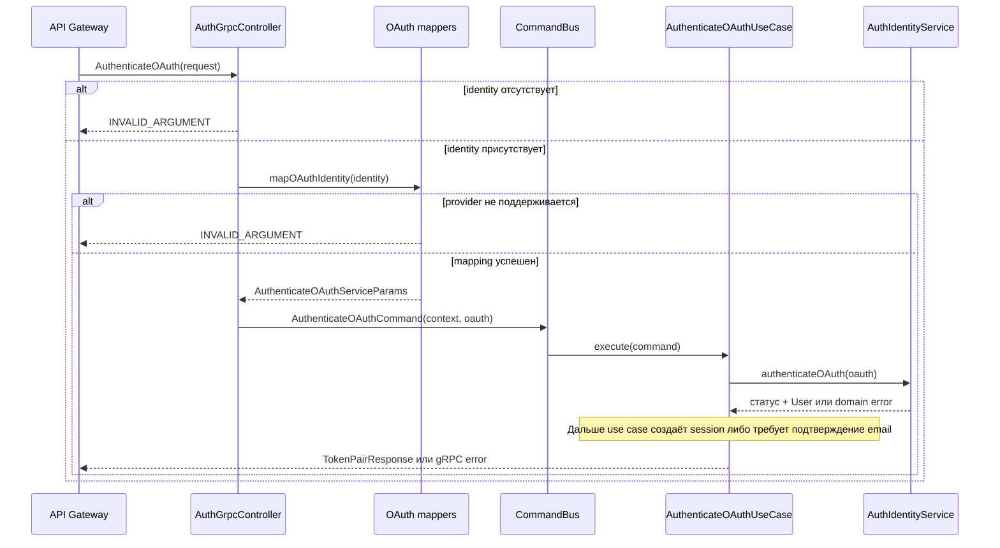

# OAuth-аутентификация: доменная модель и gRPC-контракт

## Статус документа

- Описано фактическое состояние реализации на 20 июля 2026 года.
- Область первой версии: доменная часть OAuth-аутентификации и gRPC-контракт между API Gateway и сервисом `user-accounts`.
- Application use case, создание сессии, HTTP redirect flow и уведомления упоминаются только там, где они задают границу описываемой части. Их подробное описание должно быть добавлено отдельными разделами.

## 1. Назначение фичи

OAuth-фича реализует единый сценарий входа или регистрации пользователя через внешнего провайдера. Сейчас доменная модель поддерживает GitHub и Google.

Слово `IDENTITY_LINKED` в этой фиче не означает отдельную пользовательскую операцию «привязать аккаунт». Это результат автоматического сопоставления во время входа: если OAuth identity ещё нет, но в системе уже существует пользователь с таким же email, identity добавляется к найденному пользователю при условии, что провайдер подтвердил владение email.

Основные бизнес-результаты:

1. Вход по уже известной OAuth identity.
2. Автоматическая привязка новой identity к существующему пользователю.
3. Регистрация нового пользователя с подтверждённым провайдером email.
4. Регистрация нового пользователя с последующим подтверждением email внутри Remarkgram.

## 2. Термины

| Термин | Значение |
|---|---|
| Пользователь (`User`) | Локальная учётная запись Remarkgram. |
| OAuth provider | Внешний поставщик идентификации. Допустимые значения: `github`, `google`. |
| Provider subject | Стабильный идентификатор пользователя на стороне конкретного провайдера. В gRPC передаётся как `subject`. |
| OAuth identity (`AuthIdentity`) | Связь локального пользователя с учётной записью внешнего провайдера. |
| Provider email | Email, полученный от OAuth-провайдера. Это снимок профиля провайдера, а не самостоятельный ключ владельца identity. |
| Primary email | Email, у которого в ответе провайдера установлен `primary = true`. Только он используется для регистрации и поиска локального пользователя. |
| Verified email | Email, владение которым подтверждено OAuth-провайдером (`verified = true`). |
| Автоматическое объединение | Создание новой `AuthIdentity` для уже существующего локального пользователя, найденного по подтверждённому primary email. Физического объединения двух записей `User` не происходит. |

## 3. Доменная модель

### 3.1. `AuthIdentity`

Доменная сущность находится в:

`apps/user-accounts/src/features/auth-identities/domain/auth-identity.entity.ts`

| Поле | Тип | Назначение |
|---|---|---|
| `id` | `string` (UUID) | Идентификатор identity внутри Remarkgram. |
| `userId` | `number` | Владелец identity — локальный пользователь. |
| `provider` | `'github' \| 'google'` | Внешний OAuth-провайдер. |
| `providerSubject` | `string` | Идентификатор пользователя у провайдера. |
| `providerEmail` | `string \| null` | Последний сохранённый email из профиля провайдера. |
| `providerEmailVerified` | `boolean` | Был ли сохранённый provider email подтверждён провайдером. |
| `username` | `string \| null` | Последнее сохранённое имя пользователя из профиля провайдера. Не является локальным `User.username`. |
| `avatarUrl` | `string \| null` | Последний сохранённый URL аватара из профиля провайдера. |
| `createdAt` | `Date` | Дата создания связи. |
| `updatedAt` | `Date` | Дата последнего обновления связи или профиля провайдера. |

Сущность сейчас является read-only представлением сохранённого состояния: публичного фабричного метода создания и методов изменения нет, доступен только `restore`. Создание и обновление выполняются application/service и repository слоями.

### 3.2. Связь с `User`

Один локальный пользователь может иметь несколько OAuth identities, но не более одной identity каждого провайдера. Каждая identity принадлежит ровно одному пользователю.

```mermaid
erDiagram
    USER ||--o{ AUTH_IDENTITY : имеет

    USER {
        int id PK
        string email UK
        string hash nullable
        boolean isConfirmed
        string confirmationCode nullable
        datetime confirmationExpiration nullable
        datetime deletedAt nullable
    }

    AUTH_IDENTITY {
        uuid id PK
        int userId FK
        enum provider
        string providerSubject
        string providerEmail nullable
        boolean providerEmailVerified
        string username nullable
        string avatarUrl nullable
        datetime createdAt
        datetime updatedAt
    }
```

Пользователь, созданный через OAuth, может не иметь password hash (`hash = null`). Подтверждение локального пользователя описывается value object `ConfirmationInfo`:

- подтверждённый пользователь: `isConfirmed = true`, код и срок действия отсутствуют;
- неподтверждённый пользователь: `isConfirmed = false`, код и срок действия обязательны.

### 3.3. Ограничения хранения

В Prisma/PostgreSQL зафиксированы следующие ограничения:

| Ограничение | Бизнес-смысл |
|---|---|
| `UNIQUE(provider, providerSubject)` | Одна внешняя учётная запись не может принадлежать нескольким локальным пользователям. |
| `UNIQUE(userId, provider)` | У локального пользователя не может быть двух разных identities одного провайдера. |
| `INDEX(userId)` | Ускоряет получение identities пользователя. |
| FK `AuthIdentity.userId -> User.id` | Identity не существует без локального владельца. |

Email локального активного пользователя также уникален с учётом partial unique constraint `UNIQUE(email) WHERE deletedAt IS NULL`.

### 3.4. Нормализация email

Перед доменным сравнением все email нормализуются одинаково:

```text
normalizeEmail(email) = email.trim().toLowerCase()
```

Нормализация применяется к списку email провайдера, при поиске пользователя и при проверке наличия подтверждённого системного email в ответе провайдера.

Специфичные для конкретных почтовых сервисов преобразования не выполняются: точки и `+alias` не удаляются.

## 4. Входные доменные данные

После преобразования gRPC-запроса `AuthIdentityService.authenticateOAuth` получает:

```ts
type AuthenticateOAuthServiceParams = {
  providerSubject: string;
  provider: 'github' | 'google';
  username: string | null;
  avatarUrl: string | null;
  emails: Array<{
    email: string;
    verified: boolean;
    primary: boolean;
  }>;
};
```

Для принятия решения используются:

- `provider + providerSubject` — точный ключ внешней identity;
- `username` и `avatarUrl` — данные профиля провайдера, сохраняемые в `AuthIdentity`;
- первый элемент `emails` с `primary = true` — email для поиска и регистрации;
- `primaryEmail.verified` — разрешение или запрет автоматической привязки;
- весь список `emails` — дополнительное доказательство владения email при входе в ранее неподтверждённого локального пользователя по уже существующей identity.

## 5. Доменные правила и дерево решений



### 5.1. Вход по существующей identity

Если найдена identity с точным ключом `provider + providerSubject`, владельцем считается `identity.userId`. Email из нового ответа провайдера не используется для смены владельца.

Если локальный владелец ещё не подтверждён, он может быть подтверждён автоматически только тогда, когда его системный email присутствует среди email провайдера и помечен `verified = true`.

После успешной проверки сохранённые `providerEmail`, `providerEmailVerified`, `username` и `avatarUrl` синхронизируются, если профиль изменился. Отсутствие primary email в новом ответе не стирает ранее сохранённый provider email.

Текущая реализация полностью пропускает синхронизацию профиля, если в новом ответе отсутствует primary email. Поэтому в таком ответе не обновятся не только email-поля, но и `username`/`avatarUrl`.

### 5.2. Автоматическая привязка к существующему пользователю

Если точной identity ещё нет, сервис ищет локального пользователя по нормализованному primary email.

Привязка разрешена только при `primaryEmail.verified = true`. Это ключевое правило безопасности: неподтверждённого утверждения внешнего провайдера недостаточно, чтобы получить доступ к существующему локальному аккаунту.

При успешной привязке:

- новая запись `User` не создаётся;
- создаётся `AuthIdentity` существующего пользователя;
- неподтверждённый локальный пользователь подтверждается;
- возвращается статус `IDENTITY_LINKED`;
- далее верхнеуровневый OAuth use case создаёт обычную authenticated session.

### 5.3. Регистрация

Если ни identity, ни локального пользователя с primary email нет, `User` и первая `AuthIdentity` создаются в одной транзакции.

- При verified primary email пользователь сразу подтверждён, результат — `REGISTERED`.
- При unverified primary email пользователь создаётся с confirmation code и expiration, результат — `REGISTERED_EMAIL_CONFIRMATION_REQUIRED`.

### 5.4. Обработка конкурентного создания identity

Repository использует `INSERT ... ON CONFLICT DO NOTHING`. Пустой результат вставки дополнительно классифицируется:

- identity с тем же `provider + subject` уже принадлежит ожидаемому пользователю — операция считается идемпотентной;
- identity принадлежит другому пользователю — `OAUTH_IDENTITY_LINKED_TO_ANOTHER_USER`;
- у пользователя уже есть другая identity того же провайдера — `OAUTH_PROVIDER_ALREADY_LINKED`;
- конфликт не удалось классифицировать — `OAUTH_IDENTITY_CONFLICT`.

В коде отдельно отмечена ещё не закрытая гонка: между `findByEmail` и созданием OAuth-пользователя другой запрос может создать пользователя с тем же email. Сейчас единый доменный сценарий обработки этого конфликта не реализован.

## 6. Доменные результаты

| Статус | Значение |
|---|---|
| `SIGNED_IN` | Найдена существующая identity, выполнен вход её владельца. |
| `IDENTITY_LINKED` | Identity не существовала и автоматически добавлена существующему пользователю по verified primary email. |
| `REGISTERED` | Созданы новый пользователь и identity; email подтверждён провайдером. |
| `REGISTERED_EMAIL_CONFIRMATION_REQUIRED` | Созданы новый пользователь и identity; требуется внутреннее подтверждение email. |

Эти статусы являются внутренними application-результатами. Они не входят в protobuf response: внешний успешный ответ `AuthenticateOAuth` содержит только пару токенов.

## 7. Доменные ошибки OAuth

| Application code | gRPC status | Причина |
|---|---|---|
| `OAUTH_EMAIL_REQUIRED` | `FAILED_PRECONDITION` | Провайдер не вернул непустой primary email, необходимый для поиска или регистрации. |
| `OAUTH_EMAIL_NOT_VERIFIED` | `FAILED_PRECONDITION` | Найден локальный пользователь, но primary email не подтверждён провайдером; автоматическая привязка запрещена. |
| `OAUTH_EMAIL_CONFIRMATION_REQUIRED` | `FAILED_PRECONDITION` | Требуется подтверждение email перед созданием сессии. |
| `OAUTH_IDENTITY_OWNER_NOT_FOUND` | `NOT_FOUND` | Identity существует, но связанный пользователь отсутствует. |
| `OAUTH_SESSION_CREATION_FAILED` | `FAILED_PRECONDITION` | После успешного доменного результата не удалось сохранить сессию. |
| `OAUTH_IDENTITY_LINKED_TO_ANOTHER_USER` | `ALREADY_EXISTS` | При конкурентной операции identity оказалась связана с другим пользователем. |
| `OAUTH_PROVIDER_ALREADY_LINKED` | `ALREADY_EXISTS` | У пользователя уже есть другая identity этого провайдера. |
| `OAUTH_IDENTITY_CONFLICT` | `ABORTED` | Конфликт уникальности не удалось однозначно классифицировать. |

Application error code передаётся клиенту в gRPC metadata под ключом, экспортируемым как `USER_ACCOUNTS_APP_ERROR_CODE_METADATA_KEY`.

## 8. gRPC-контракт

Источник контракта:

`libs/contracts/user-accounts-grpc/src/proto/user-accounts.proto`

```proto
enum OAuthProvider {
  OAUTH_PROVIDER_UNSPECIFIED = 0;
  OAUTH_PROVIDER_GITHUB = 1;
  OAUTH_PROVIDER_GOOGLE = 2;
}

message OAuthEmail {
  string email = 1;
  bool verified = 2;
  bool primary = 3;
}

message OAuthIdentityClaims {
  OAuthProvider provider = 1;
  string subject = 2;
  string username = 3;
  string avatar_url = 4;
  repeated OAuthEmail emails = 5;
}

message AuthenticateOAuthRequest {
  OAuthIdentityClaims identity = 1;
  string ip = 2;
  string device_name = 3;
}

service AuthService {
  rpc AuthenticateOAuth(AuthenticateOAuthRequest) returns (TokenPairResponse);
}
```

Успешный ответ:

```proto
message TokenPairResponse {
  string access_token = 1;
  string refresh_token = 2;
}
```

### 8.1. Семантика полей `OAuthIdentityClaims`

| Поле | Обязательность по фактической логике | Использование в `user-accounts` |
|---|---|---|
| `provider` | Обязательно, не `UNSPECIFIED` | Преобразуется в доменное значение `github` или `google`. |
| `subject` | Обязательно и непусто | Обрезаются пробелы; вместе с provider образует ключ identity. |
| `username` | Не обязателен для идентификации | Передаётся в application DTO, сохраняется в `AuthIdentity` и обновляется при повторном входе. |
| `avatar_url` | Не обязателен для идентификации | Передаётся в application DTO как `avatarUrl`, сохраняется в `AuthIdentity` и обновляется при повторном входе. |
| `emails` | Нужен для новых identity; для существующей identity может использоваться для подтверждения владельца и синхронизации | Преобразуется в `OAuthEmail[]`. |

### 8.2. Семантика полей `AuthenticateOAuthRequest`

| Поле | Использование |
|---|---|
| `identity` | Обязательно. При отсутствии контроллер должен вернуть `INVALID_ARGUMENT`. |
| `ip` | Передаётся в контекст создания device session. |
| `device_name` | Передаётся в контекст создания device session. |

Поле `current_session` удалено из `AuthenticateOAuthRequest`: OAuth endpoint выполняет вход или регистрацию, а `IDENTITY_LINKED` является автоматическим бизнес-результатом поиска по verified email. Это не отдельная авторизованная команда привязки provider account.

### 8.3. Преобразование transport DTO в application DTO



Точное отображение provider:

| Protobuf | Domain |
|---|---|
| `OAUTH_PROVIDER_GITHUB` | `github` |
| `OAUTH_PROVIDER_GOOGLE` | `google` |
| `OAUTH_PROVIDER_UNSPECIFIED` | ошибка `INVALID_ARGUMENT` |
| `UNRECOGNIZED` | ошибка `INVALID_ARGUMENT` |

`username` и `avatar_url` попадают в application DTO и хранятся как профильные атрибуты `AuthIdentity`. Они не участвуют в поиске владельца, регистрации или автоматической привязке и не изменяют локальный `User.username`.

Protobuf `string` не различает отсутствующее значение и пустую строку без применения `optional`. Поэтому текущий gRPC mapper передаёт `''`, а не `null`, если Gateway не предоставил username или avatar URL. Хотя доменная и Prisma-модели объявляют поля nullable, обычный gRPC flow фактически может сохранять пустые строки.

## 9. Граница доверия и валидация

В текущей архитектуре OAuth-провайдер проверяется в API Gateway. Например, GitHub strategy получает profile и отдельно запрашивает `GET https://api.github.com/user/emails`, после чего Gateway передаёт нормализованные claims по внутреннему gRPC.

На стороне Gateway уже проверяется:

- корректность типа списка email;
- структура каждого элемента;
- отсутствие пустых email;
- отсутствие дубликатов после `trim().toLowerCase()`;
- наличие непустого GitHub subject;
- ожидаемый provider для GitHub flow.

На стороне `user-accounts` дополнительно проверяется поддерживаемый provider, но gRPC mapper сам по себе:

- не отклоняет пустой `subject` после `trim()`;
- не проверяет, что primary email ровно один;
- выбирает первый email с `primary = true`, если таких элементов несколько;
- не проверяет формат email;
- не нормализует пустые `username` и `avatar_url` в `null`.

Следовательно, безопасность текущего flow опирается на доверенный внутренний вызов от API Gateway и его предварительную проверку claims. Если gRPC endpoint станет доступен другим вызывающим сторонам, перечисленные инварианты следует валидировать непосредственно на границе `user-accounts`.

## 10. Последовательность gRPC-вызова



## 11. Зафиксированные особенности и технические долги

1. В ветке отсутствующей `identity` контроллер создаёт `RpcException` с полем `status`, тогда как остальные gRPC errors используют поле `code`. Это следует проверить и унифицировать.
2. На gRPC-границе `user-accounts` отсутствует полная самостоятельная валидация subject и списка email.
3. Выбор primary email реализован как поиск первого элемента; уникальность primary email не является доменным инвариантом внутри сервиса.
4. Пустые protobuf-строки для `username` и `avatar_url` не преобразуются в `null`, несмотря на nullable-поля доменной модели и БД.
5. При отсутствии primary email метод синхронизации досрочно завершается и не обновляет `username`/`avatarUrl`.
6. Не завершена обработка гонки между поиском пользователя по email и созданием нового OAuth-пользователя.
7. Миграция добавляет `username` и `avatarUrl` как nullable-колонки без backfill, что совместимо с существующими строками.
8. В исходниках присутствуют комментарии с повреждённой кодировкой; это не влияет на runtime, но затрудняет сопровождение.

## 12. Карта исходников

| Зона | Файл |
|---|---|
| Доменная сущность identity | `apps/user-accounts/src/features/auth-identities/domain/auth-identity.entity.ts` |
| Доменная сущность пользователя | `apps/user-accounts/src/features/users/domain/entities/user.entity.ts` |
| Состояние подтверждения пользователя | `apps/user-accounts/src/features/users/domain/value-objects/confirmation-info.ts` |
| Нормализация email | `apps/user-accounts/src/features/users/domain/email-normalization.ts` |
| Доменное дерево OAuth-решений | `apps/user-accounts/src/features/auth-identities/application/auth-identity.service.ts` |
| Входные типы и результаты | `apps/user-accounts/src/features/auth-identities/application/types/auth-identities.types.ts` |
| OAuth application errors | `apps/user-accounts/src/features/auth-identities/application/errors/auth-identity.errors.ts` |
| Ограничения БД | `apps/user-accounts/prisma/schema.prisma` |
| Protobuf-контракт | `libs/contracts/user-accounts-grpc/src/proto/user-accounts.proto` |
| gRPC-контроллер | `apps/user-accounts/src/features/auth/presentation/grpc/controllers/auth-grpc.controller.ts` |
| Mapper provider | `apps/user-accounts/src/features/auth/presentation/grpc/mappers/oauth-provider.mapper.ts` |
| Mapper identity | `apps/user-accounts/src/features/auth/presentation/grpc/mappers/oauth-identity.mapper.ts` |
| Domain error -> gRPC status | `apps/user-accounts/src/common/grpc/filters/user-accounts-rpc-error.mapper.ts` |
| Формирование GitHub claims в Gateway | `apps/api-gateway/src/modules/user-accounts/presentation/http/guards/github/github.strategy.ts` |
| Валидация claims в Gateway | `apps/api-gateway/src/modules/user-accounts/presentation/http/mappers/oauth-identity-claims.mapper.ts` |

## 13. Следующие разделы документации

В следующих итерациях целесообразно добавить:

1. Application orchestration: `AuthenticateOAuthUseCase`, события и создание сессии.
2. Полный HTTP/GitHub redirect flow в API Gateway.
3. Таблицу всех пользовательских сценариев и ожидаемых HTTP/gRPC результатов.
4. Транзакционные границы и конкурентные сценарии.
5. Набор unit/e2e тестов как исполняемую спецификацию фичи.
