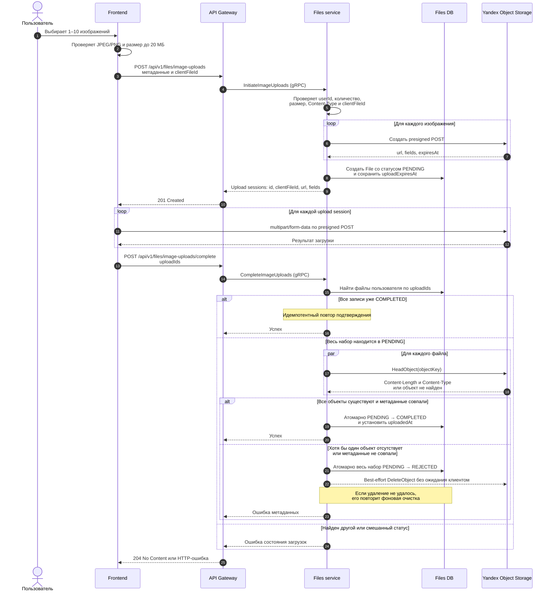
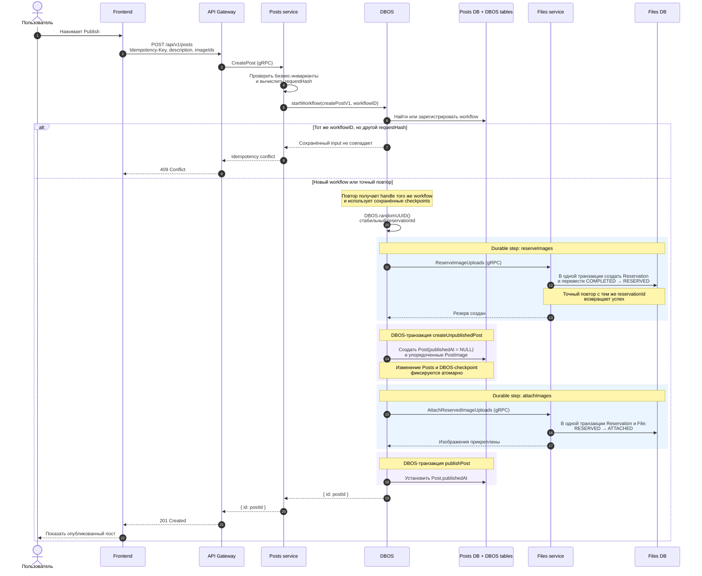
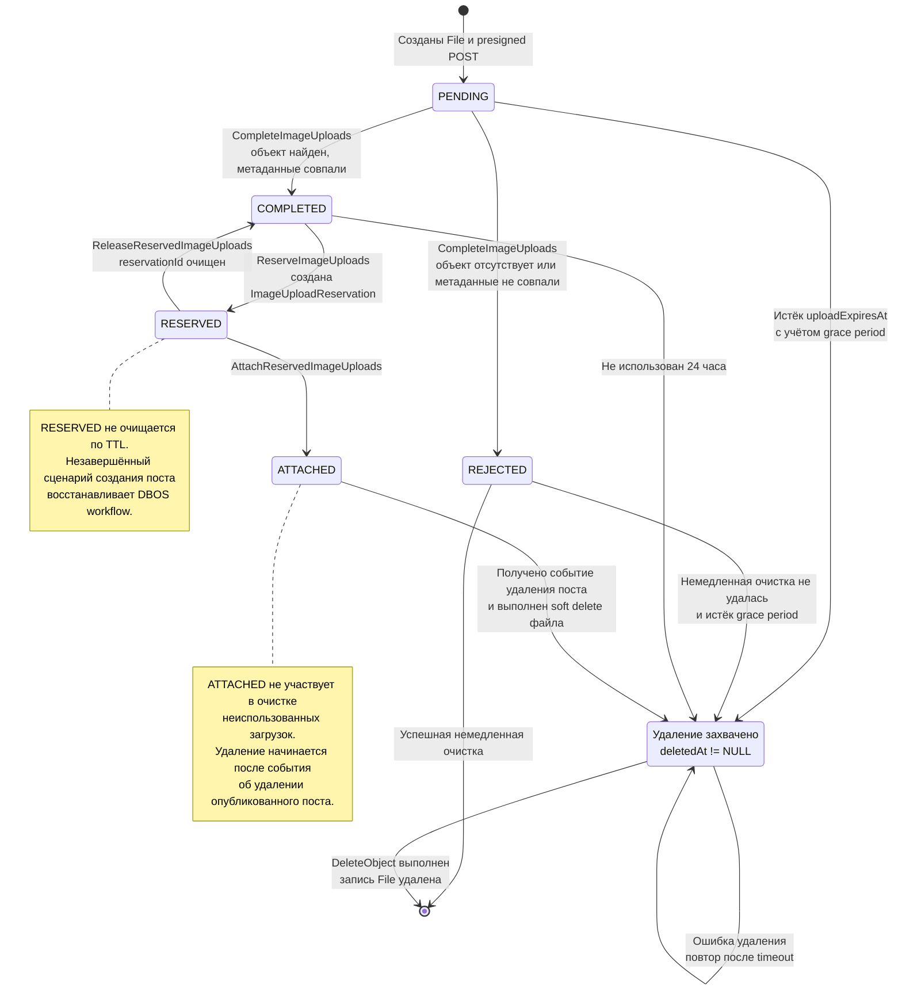

# Жизненный цикл изображений и создание поста

Документ описывает текущие сценарии загрузки изображений и создания поста через DBOS.
Диаграммы отражают состояние кода, а не целевую архитектуру.

## Загрузка и подтверждение изображений

## Создание поста с DBOS

### Компенсации и восстановление создания поста

- Если создание `Post` завершается известным конфликтом после резерва, DBOS выполняет durable
  `releaseReservation`: `RESERVED → COMPLETED`.
- Если `attachImages` возвращает известную бизнес-ошибку, DBOS освобождает резерв и удаляет
  неопубликованный `Post`.
- Неизвестная инфраструктурная ошибка не запускает слепую компенсацию. Workflow сохраняется для
  диагностики и восстановления, а `Post` с `publishedAt = NULL` не виден читателям.
- После падения процесса DBOS продолжает workflow с последнего checkpoint. Повтор gRPC-шага
  безопасен благодаря стабильному `reservationId` и идемпотентным операциям Files.
- Повтор HTTP-запроса с тем же `Idempotency-Key` получает результат того же workflow. Тот же ключ
  с другим содержимым запроса возвращает `409 Conflict`.

## Состояния File

`PENDING`, `COMPLETED`, `REJECTED`, `RESERVED` и `ATTACHED` — значения `File.uploadStatus`.
Состояние `DELETION_CLAIMED` на диаграмме обозначает запись с заполненным `deletedAt`, а не
дополнительное значение enum.

## Связь File и ImageUploadReservation

- `ImageUploadReservation.id` — стабильный `reservationId`, созданный внутри DBOS workflow.
- Резервация хранит владельца и полный отсортированный набор `uploadIds`.
- `reserve`, `attach` и `release` атомарно изменяют агрегат резервации и связанные записи `File`.
- Статусы агрегата `RESERVED`, `ATTACHED`, `RELEASED` обеспечивают распознавание точных повторов.
- После `release` резервация остаётся в `RELEASED`, а файлы возвращаются в `COMPLETED` и теряют
  ссылку `reservationId`.

## Фоновая очистка неиспользованных загрузок

Одна задача обрабатывает не более 100 записей за запуск:

- `PENDING` — спустя 15 минут после `uploadExpiresAt`;
- `REJECTED` — спустя 15 минут после отклонения, если немедленное удаление не завершилось;
- `COMPLETED` — спустя 24 часа после `uploadedAt`, если файл не зарезервирован;
- незавершённую попытку очистки можно повторно захватить спустя один час.

Перед обращением в S3 запись помечается через `deletedAt`. После успешного `DeleteObject` запись
физически удаляется из Files DB. `DeleteObject` идемпотентен, поэтому повтор безопасен.
