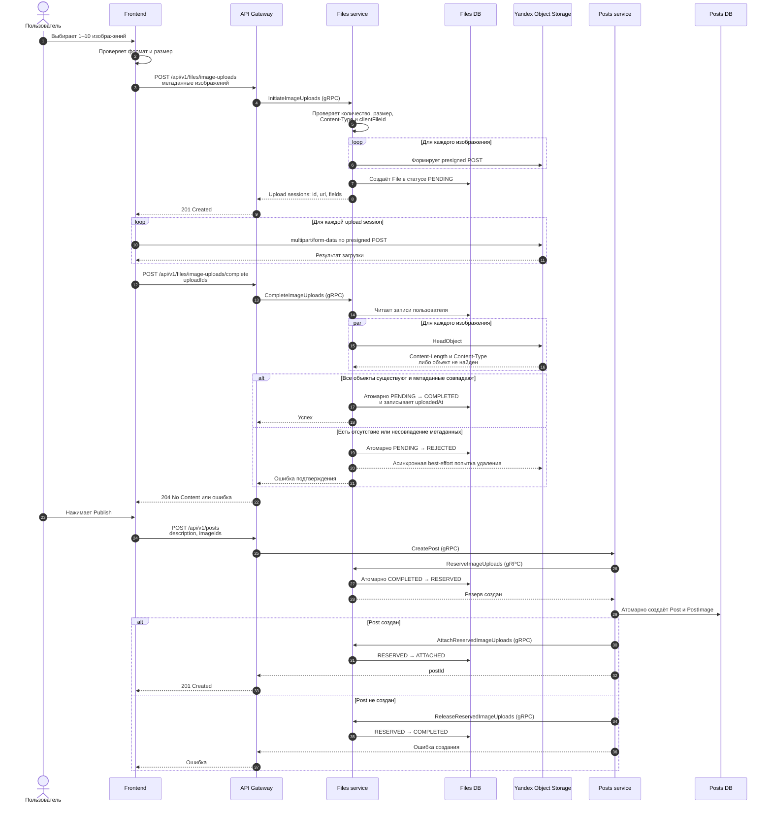
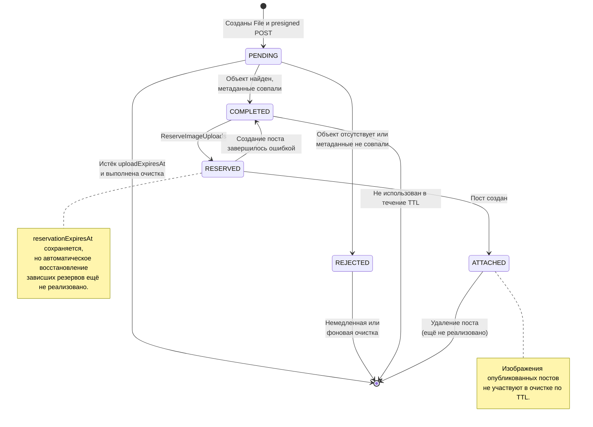

# Image upload lifecycle

Документ описывает текущий процесс загрузки изображений, создания поста и фоновой очистки.

## Sequence diagram

## State diagram

## Фоновая очистка

Одна ежедневная задача обрабатывает не более 100 записей за запуск:

- `PENDING` — спустя 15 минут после `uploadExpiresAt`;
- `REJECTED` — спустя 15 минут после отклонения, если немедленное удаление не завершилось;
- `COMPLETED` — спустя 24 часа после `uploadedAt`, если изображение не зарезервировано;
- повторно захватывает незавершённую попытку очистки спустя один час.

Перед обращением в S3 запись помечается через `deletedAt`. После успешного `DeleteObject` она
физически удаляется из БД. `DeleteObject` идемпотентен, поэтому повтор безопасен.

## Текущие ограничения

- Заголовок `Idempotency-Key` описан в Swagger, но идемпотентность всего `POST /posts` ещё не реализована.
- Состояние операции резервирования пока не хранится в отдельной таблице.
- Если пост записан, а `AttachReservedImageUploads` не завершился, автоматического восстановления пока нет.
- Просроченные `RESERVED` нельзя освобождать без проверки состояния создания поста, поэтому cron их не меняет.
- Удаление `ATTACHED` должно быть частью сценария удаления поста и пока не реализовано.
