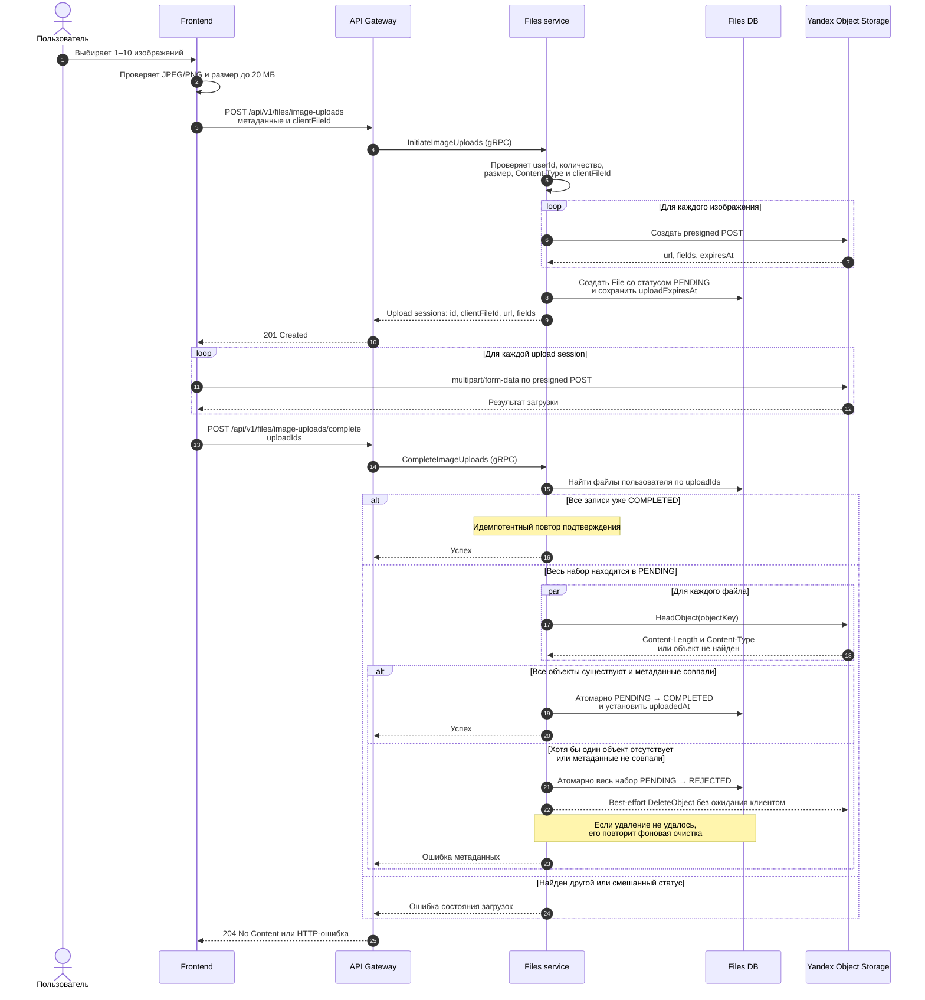
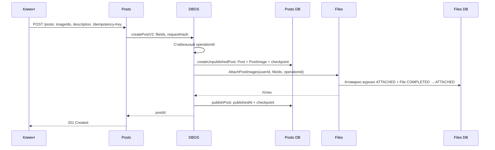
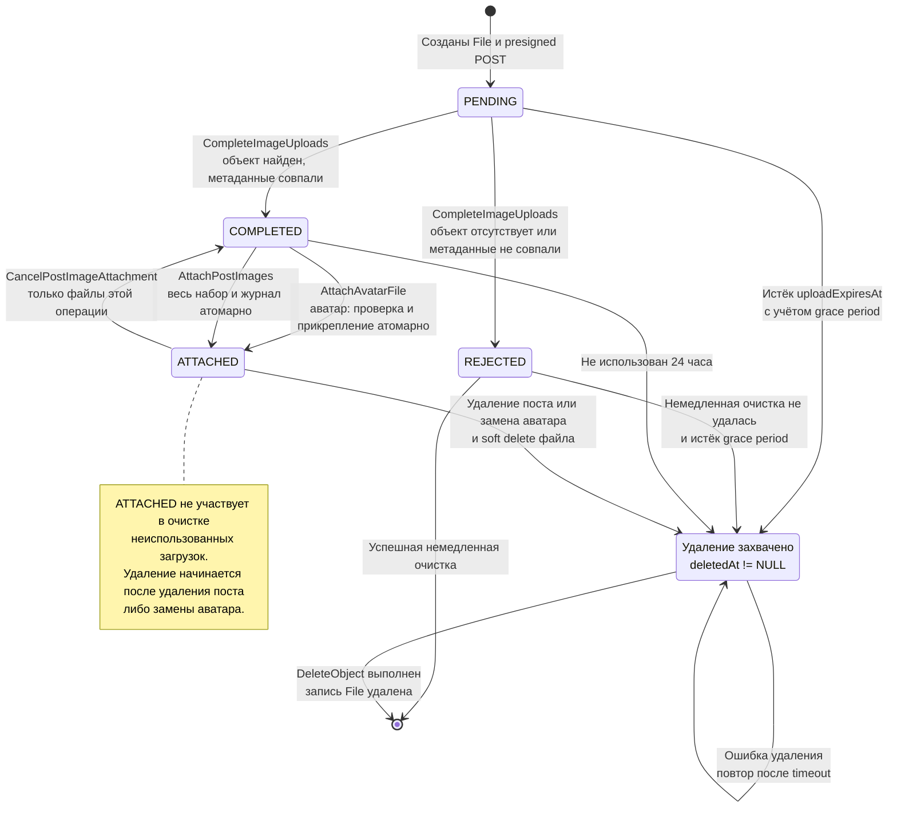

# Жизненный цикл изображений, постов и аватаров

Документ описывает загрузку изображений, создание поста и установку аватара через DBOS.
Диаграммы отражают состояние кода, а не целевую архитектуру.

## Загрузка и подтверждение изображений


```mermaid
sequenceDiagram
    autonumber
    actor User as Пользователь
    participant Frontend
    participant Gateway as API Gateway
    participant Files as Files service
    participant FilesDB as Files DB
    participant S3 as Yandex Object Storage

    User->>Frontend: Выбирает 1–10 изображений
    Frontend->>Frontend: Проверяет JPEG/PNG и размер до 20 МБ
    Frontend->>Gateway: POST /api/v1/files/image-uploads<br/>метаданные и clientFileId
    Gateway->>Files: InitiateImageUploads (gRPC)
    Files->>Files: Проверяет userId, количество,<br/>размер, Content-Type и clientFileId

    loop Для каждого изображения
        Files->>S3: Создать presigned POST
        S3-->>Files: url, fields, expiresAt
    end

    Files->>FilesDB: Создать File со статусом PENDING<br/>и сохранить uploadExpiresAt
    Files-->>Gateway: Upload sessions: id, clientFileId, url, fields
    Gateway-->>Frontend: 201 Created

    loop Для каждой upload session
        Frontend->>S3: multipart/form-data по presigned POST
        S3-->>Frontend: Результат загрузки
    end

    Frontend->>Gateway: POST /api/v1/files/image-uploads/complete<br/>uploadIds
    Gateway->>Files: CompleteImageUploads (gRPC)
    Files->>FilesDB: Найти файлы пользователя по uploadIds

    alt Все записи уже COMPLETED
        Note over Files: Идемпотентный повтор подтверждения
        Files-->>Gateway: Успех
    else Весь набор находится в PENDING
        par Для каждого файла
            Files->>S3: HeadObject(objectKey)
            S3-->>Files: Content-Length и Content-Type<br/>или объект не найден
        end

        alt Все объекты существуют и метаданные совпали
            Files->>FilesDB: Атомарно PENDING → COMPLETED<br/>и установить uploadedAt
            Files-->>Gateway: Успех
        else Хотя бы один объект отсутствует<br/>или метаданные не совпали
            Files->>FilesDB: Атомарно весь набор PENDING → REJECTED
            Files-->>S3: Best-effort DeleteObject без ожидания клиентом
            Note over Files,FilesDB: Если удаление не удалось,<br/>его повторит фоновая очистка
            Files-->>Gateway: Ошибка метаданных
        end
    else Найден другой или смешанный статус
        Files-->>Gateway: Ошибка состояния загрузок
    end

    Gateway-->>Frontend: 204 No Content или HTTP-ошибка
```

## Загрузка аватара

`POST /api/v1/files/avatar-upload` требует авторизации и принимает метаданные одного файла
(один объект, не массив):

```json
{
  "clientFileId": "11111111-1111-4111-8111-111111111111",
  "originalFilename": "avatar.jpg",
  "contentType": "image/jpeg",
  "size": 1048576
}
```

Files проверяет JPEG/PNG и размер от 1 до 10 МиБ включительно (`10485760` байт).
Для изображений постов сохраняется прежний лимит 20 МиБ. Назначение файла (`purpose`)
не хранится. Оба сценария используют общий сервис создания сессий и записей `File`.

Ответ `201 Created` содержит одну сессию `{ id, clientFileId, url, fields }`.
`id` — идентификатор файла в Files и `uploadId` для подтверждения. Фронтенд отправляет
файл непосредственно в Object Storage:

```js
const form = new FormData();
for (const [key, value] of Object.entries(session.fields)) {
  form.append(key, value);
}
form.append('file', file);
const response = await fetch(session.url, { method: 'POST', body: form });
if (!response.ok) throw new Error('Upload failed');
// После успешной загрузки:
// POST /api/v1/files/image-uploads/complete
// Authorization: Bearer <accessToken>
// { "uploadIds": [session.id] }
```

Существующее подтверждение проверяет владельца, состояние и совпадение размера и MIME-типа
с метаданными S3, затем переводит файл из `PENDING` в `COMPLETED`. Два одновременных
подтверждения одного набора также успешны: если условный UPDATE не изменил весь набор,
транзакция откатывается, а репозиторий проверяет, что все файлы уже `COMPLETED`,
принадлежат пользователю и не удалены. Частично подтверждённый набор остаётся ошибкой;
время первого подтверждения не перезаписывается.
Для установки в профиль после подтверждения вызывается `PUT /api/v1/users/me/profile/avatar`
с `{ "fileId": "<session.id>" }` и заголовком `Idempotency-Key: <UUID v4>`.
Подробности: [установка и замена аватара](set-avatar.md).
Получение файла через `/files/images/:fileId` доступно только после прикрепления (`ATTACHED`).
Для превью до установки используется локальный файл на фронтенде.

Неприкреплённый `COMPLETED` становится доступным для фоновой очистки через 24 часа после
подтверждения. Неоконченные загрузки очищаются по существующим правилам `PENDING`/`REJECTED`.

## Создание поста с DBOS


```mermaid
sequenceDiagram
    participant Client as Клиент
    participant Posts
    participant DBOS
    participant PostsDB as Posts DB
    participant Files
    participant FilesDB as Files DB
    Client->>Posts: POST /posts: imageIds, description, Idempotency-Key
    Posts->>DBOS: createPostV2: fileIds, requestHash
    DBOS->>DBOS: Стабильный operationId
    DBOS->>PostsDB: createUnpublishedPost: Post + PostImage + checkpoint
    DBOS->>Files: AttachPostImages(userId, fileIds, operationId)
    Files->>FilesDB: Атомарно журнал ATTACHED + File COMPLETED → ATTACHED
    Files-->>DBOS: Успех
    DBOS->>PostsDB: publishPost: publishedAt + checkpoint
    DBOS-->>Posts: postId
    Posts-->>Client: 201 Created
```

Скрытый пост не виден в чтении и не доступен для обычного изменения/удаления. Уникальная
связь `PostImage.fileId` проверяется до обращения в Files; порядок изображений сохраняется.
Files прикрепляет весь набор одной транзакцией. Частичный успех откатывается вместе с журналом.

### Компенсации и восстановление

- Конфликт создания скрытого поста не требует компенсации Files: вызова ещё не было.
- При известном отказе прикрепления workflow вызывает `CancelPostImageAttachment`, затем
  удаляет скрытый пост. Отмена записывается даже до первого успешного Attach: поздний запрос
  с тем же operationId уже не сможет прикрепить файлы.
- Ошибка компенсации сохраняет скрытый пост. Неизвестный результат RPC и техническая ошибка
  публикации поста не запускают слепое открепление.
- До Attach файлы остаются `COMPLETED` и доступны очистке через 24 часа. Если очистка
  успела первой, прикрепление отклоняется и скрытый пост компенсируется.
- При падении процесса DBOS восстанавливает checkpoint и прежний operationId. Локальные
  изменения Posts фиксируются вместе с checkpoint; повтор Files безопасен по журналу.
- Три попытки Files имеют паузы 1 и 2 секунды. Исчерпание попыток завершает workflow ошибкой,
  а не запускает автоматическое восстановление. Может остаться скрытый пост и прикреплённые
  файлы; требуется отдельное восстановление. Повтор старого ключа возвращает сохранённую ошибку.
- Точный повтор успешного HTTP-запроса получает прежний результат. Изменение параметров
  с тем же ключом возвращает `409 Conflict`.

## Состояния File

`PENDING`, `COMPLETED`, `REJECTED` и `ATTACHED` — значения `File.uploadStatus`.
Состояние `DELETION_CLAIMED` на диаграмме обозначает запись с заполненным `deletedAt`, а не
дополнительное значение enum.


```mermaid
stateDiagram-v2
    [*] --> PENDING: Созданы File и presigned POST

    PENDING --> COMPLETED: CompleteImageUploads<br/>объект найден, метаданные совпали
    PENDING --> REJECTED: CompleteImageUploads<br/>объект отсутствует или метаданные не совпали

    COMPLETED --> ATTACHED: AttachAvatarFile<br/>аватар: проверка и прикрепление атомарно
    COMPLETED --> ATTACHED: AttachPostImages<br/>весь набор и журнал атомарно
    ATTACHED --> COMPLETED: CancelPostImageAttachment<br/>только файлы этой операции

    state "Удаление захвачено<br/>deletedAt != NULL" as DELETION_CLAIMED

    PENDING --> DELETION_CLAIMED: Истёк uploadExpiresAt<br/>с учётом grace period
    REJECTED --> [*]: Успешная немедленная очистка
    REJECTED --> DELETION_CLAIMED: Немедленная очистка не удалась<br/>и истёк grace period
    COMPLETED --> DELETION_CLAIMED: Не использован 24 часа
    ATTACHED --> DELETION_CLAIMED: Удаление поста или замена аватара<br/>и soft delete файла

    DELETION_CLAIMED --> [*]: DeleteObject выполнен<br/>запись File удалена
    DELETION_CLAIMED --> DELETION_CLAIMED: Ошибка удаления<br/>повтор после timeout

    note right of ATTACHED
        ATTACHED не участвует в очистке
        неиспользованных загрузок.
        Удаление начинается после удаления поста
        либо замены аватара.
    end note
```

## Журнал прикрепления файлов поста

`PostImageAttachmentOperation` хранится в `post_image_attachment_operations`: UUID операции,
владелец, `fileIdsHash`, `ATTACHED`/`CANCELLED` и даты. Хеш — SHA-256 отсортированных UUID
в нижнем регистре, соединённых запятой. Он фиксирует состав исходного запроса после
открепления или удаления файлов, но не определяет порядок изображений в посте.

`File.postImageAttachmentOperationId` — nullable внешний ключ; одна операция объединяет
несколько файлов. Attach и Cancel блокируют строку журнала и изменяют её вместе с файлами.
Точный Attach в состоянии ATTACHED возвращает прежний успех даже после удаления файла.
CANCELLED терминален: поздний Attach отклоняется. Повтор Cancel ничего не меняет;
отмена изменяет только свои неудалённые ATTACHED-файлы и не перезаписывает новую операцию.
История операций автоматически не очищается.

Аватар продолжает использовать отдельное уникальное `File.avatarAttachmentOperationId`.
Общий статус ATTACHED не означает общий идентификатор операции: у поста несколько файлов,
у операции аватара один. После физического удаления файла аватара повтор его RPC возвращает
ошибку отсутствия файла; журнал постов не участвует в этом сценарии.

## Внедрение createPostV2

1. Остановить старые экземпляры Posts и Files, исключить recovery старых незавершённых workflow.
2. Проверить старые скрытые посты и разобрать их до запуска новой версии. Миграция Files
   отменяет резервы, но не удаляет Post/PostImage в другой БД. Опубликованные посты не удалять.
3. Применить новую миграцию Files `20260927120000_replace_post_image_reservations`.
   Она сохраняет ATTACHED, преобразует RELEASED/RESERVED в CANCELLED, освобождает
   RESERVED-файлы, переносит массивы в хеши и удаляет RESERVED из enum файла.
4. Согласованно обновить Files и Posts. Старые RPC удалены; историю createPostV1 не переносить
   и не восстанавливать новой последовательностью. Для новых запросов использовать новые ключи.

Применённые миграции и системные таблицы DBOS не изменяются.

## Фоновая очистка неиспользованных загрузок

Одна задача обрабатывает не более 100 записей за запуск:

- `PENDING` — спустя 15 минут после `uploadExpiresAt`;
- `REJECTED` — спустя 15 минут после отклонения, если немедленное удаление не завершилось;
- `COMPLETED` — спустя 24 часа после `uploadedAt`, если файл свободен и ещё не прикреплён;
- незавершённую попытку очистки можно повторно захватить спустя один час.

Перед обращением в S3 запись помечается через `deletedAt`. После успешного `DeleteObject` запись
физически удаляется из Files DB. `DeleteObject` идемпотентен, поэтому повтор безопасен.
