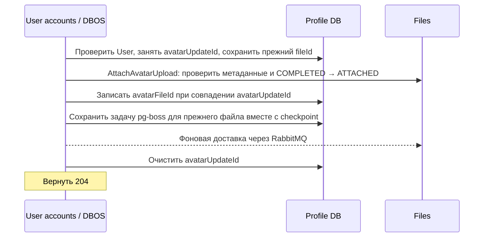

# Установка и замена аватара

После загрузки и подтверждения файла фронтенд вызывает:

```http
PUT /api/v1/users/me/profile/avatar
Authorization: Bearer <accessToken>
Idempotency-Key: 22222222-2222-4222-8222-222222222222
Content-Type: application/json

{"fileId":"11111111-1111-4111-8111-111111111111"}
```

`fileId` — UUID v4 из upload session, не objectKey. Файл должен принадлежать пользователю,
быть подтверждённым, ещё не прикреплённым, иметь MIME `image/jpeg` или `image/png` и размер
от 1 до **10 МиБ включительно**. Можно использовать файл из endpoint изображений постов,
если он удовлетворяет этим правилам. Files повторно проверяет сохранённые метаданные;
поля `purpose` нет.

`204 No Content` означает, что аватар уже установлен. Теперь можно перейти в профиль.
`GET /api/v1/users/me/profile` и `GET /api/v1/users/{userId}/profile` возвращают `avatarFileId`;
`GET /api/v1/files/images/{fileId}` перенаправляет на подписанный URL изображения.
`/auth/me` не изменён. Профиль создаётся при первой установке, даже если персональные поля
ещё не заполнены. Отдельное удаление описано в [delete-avatar.md](delete-avatar.md).

## Идемпотентность и ошибки

Ключ создаётся один раз на действие Save. При потере ответа клиент повторяет
**тот же ключ и fileId**. UUID нормализуются в нижний регистр. Повтор завершённой операции
возвращает сохранённый результат, даже если аватар позднее заменён другой операцией.
Повтор текущего файла с новым ключом — успешная операция без изменений.

| HTTP | Значение                                                                                         |
| ---- | ------------------------------------------------------------------------------------------------ |
| 400  | Неверный UUID, ключ или метаданные файла                                                         |
| 401  | Нет действительной авторизации                                                                   |
| 404  | Пользователь отсутствует либо файл недоступен владельцу                                          |
| 409  | Другая смена аватара выполняется, файл занят/не подтверждён или ключ использован с другим файлом |
| 503  | Files временно недоступен; ошибка записана, требуется разбор состояния операции                  |

При нарушении размера или формата: `INVALID_AVATAR_IMAGE`, сообщение
`The photo must be less than 10 Mb and have JPEG or PNG format`.
Формулировка сообщения сохранена из требований; фактическая верхняя граница включительная.
После окончательного бизнес-отказа новая попытка использует новый ключ.

## Выполнение саги

Workflow `setAvatarV1` имеет ID `set-avatar:{userId}:{idempotencyKey}`.
DBOS создаёт стабильный UUID, используемый как `avatarUpdateId` и `operationId`.



Захват права изменения и чтение прежнего аватара выполняются одной короткой транзакцией
с блокировкой строки User, включая создание отсутствующего Profile. `avatarUpdateId` —
семантическая блокировка смены аватара. Второй запрос с другим ключом получает `409`;
редактирование остальных полей разрешено. До переключения ссылки читатели видят старый аватар.
Изменения Profile и checkpoint DBOS фиксируются одной транзакцией прикладной БД.

Вызов Files `attachAvatar` оформлен как `@DBOS.step()`. Методы `acquireAvatarUpdate`,
`updateProfileAvatar`, постановка задачи pg-boss в `scheduleFileDeletion` и `releaseAvatarUpdate`
используют `PrismaDataSource.runTransaction`: изменения данных и checkpoint фиксируются вместе.
`startFileDeletionPublication` — отдельный `@DBOS.step()`, который запускает отправку сохранённого
сообщения в фоне. Завершение отправки не блокирует workflow; ошибки сохраняет pg-boss.
Захват блокировки возвращает `alreadyCurrent` и `previousAvatarFileId`, сохранённые в checkpoint.

`AttachAvatarUpload(userId, fileId, operationId)` атомарно прикрепляет файл и проверяет его
размер/формат в одной транзакции Files. Ошибка откатывает все изменения. Условное обновление
повторно проверяет владельца, `COMPLETED`, отсутствие резерва и `deletedAt`, защищая от
конкуренции с постами и очисткой. Очистка захватывает пачку одним SQL-запросом:
`UPDATE ... WHERE id IN (SELECT ... LIMIT ... FOR UPDATE SKIP LOCKED) RETURNING ...`.
Подзапрос блокирует выбранные строки до завершения обновления и пропускает занятые
прикреплением или другой очисткой файлы.
Для дедупликации аватара `operationId` сохраняется непосредственно в nullable UUID-поле
`File.attachmentOperationId` вместе со статусом `ATTACHED`. Уникальный индекс запрещает
использовать этот ID для другого существующего файла. `ImageUploadReservation` и
`File.reservationId` остаются для резервирования изображений постов; аватар их не использует.
Точный повтор успешен, пока запись файла существует, в том числе после soft delete.
После физического удаления файла повтор RPC получает `IMAGE_UPLOAD_NOT_FOUND`: история
прикрепления отдельно не хранится. Повтор завершённого HTTP-запроса с тем же ключом
по-прежнему получает сохранённый результат DBOS, без нового вызова Files.

Явные gRPC-дедлайны пока не задаются. Повторных попыток на уровне workflow нет.
Ретраи, дедлайны и deadline propagation в gRPC-адаптерах отложены. При временной ошибке Files
workflow записывает ошибку, возвращает `503` и сохраняет блокировку; повтор с тем же ключом
воспроизводит эту ошибку. Компенсация при неизвестном результате RPC не запускается.
Восстановление незавершённого workflow после падения процесса использует прежний operationId.
Запрос ожидает `handle.getResult()` без собственного таймера ожидания workflow.

При окончательном отказе AttachAvatarUpload снимается только блокировка профиля: транзакция
Files уже откатила прикрепление. Отдельного резерва и его освобождения для аватара нет.
Освобождение выполняется одним условным UPDATE по `userId` и `avatarUpdateId`: отсутствие
своей блокировки считается успешным отсутствием действий, блокировка другой операции не меняется.
Компенсация прикрепления применяется только для ошибок отсутствующего, недоступного файла
или недопустимых метаданных; остальные ошибки сохраняются без компенсации.
Если файл уже прикреплён, но пользователя удалили до записи профиля, новый файл ставится
на удаление. После успешного переключения новый аватар сохраняется, даже если постановка
старого файла на удаление временно не удаётся. Блокировка освобождается после сохранения задачи pg-boss.

Files атомарно выполняет soft delete принадлежащего пользователю `ATTACHED`-файла и создаёт
`FileDeletionJob`. Повтор для удалённого/отсутствующего файла безопасен; чужой файл не изменяется.
Другой активный статус отклоняется. Существующий worker удаляет объект и запись File.
Ожидания физического удаления в SetAvatar нет. До установки `COMPLETED` по-прежнему
подлежит очистке через 24 часа; `RESERVED` и `ATTACHED` этой очисткой не затрагиваются.

Запрос удаления теперь сохраняется в pg-boss в БД user-accounts. После commit выполняется немедленная
фоновая отправка через RabbitMQ; резервный проход — раз в 6 часов. Недоступность брокера
не удерживает блокировку профиля: для завершения workflow достаточно сохранённой задачи pg-boss.
При ошибке самой транзакции постановки задачи блокировка остаётся для восстановления DBOS.
Подробности доставки и настройка панели: [delete-avatar.md](delete-avatar.md).

## Настройка и развёртывание

Перед обновлением завершить активные workflow: шаг удаления теперь сохраняет задачу pg-boss.

1. Подготовить `AMQPS_URL`, `FILES_GRPC_URL` и `USER_ACCOUNTS_DBOS_SYSTEM_DATABASE_URL` в окружении
   user-accounts / secret `remarkgram-user-accounts-production-config-secret`.
   Системное подключение DBOS должно быть прямым либо session-pooled.
2. Применить миграции Files (`pnpm prisma:files:migrate:deploy`) и user-accounts
   (`pnpm prisma:user-accounts:migrate:deploy`) до запуска обновлённых сервисов.
   Они добавляют nullable `files.attachmentOperationId` с уникальным индексом и
   `profiles.avatar_update_id`; существующие значения — `NULL`. Миграция удаления аватара
   создаёт `avatar_deletion_requests` в user-accounts. Схему `pgboss` создаёт библиотека при запуске.
3. Развернуть Files с новыми RPC, затем user-accounts, затем Gateway.
4. Проверить установку, замену, чтение профиля и редирект изображения.

DBOS использует имя `remarkgram-user-accounts`, версию `set-avatar-v1`, datasource
`user-accounts-prisma` и executor `remarkgram-user-accounts-singleton`, по текущему образцу Posts.
При bootstrap создаётся schema checkpoints в прикладной БД и запускается DBOS;
при завершении DBOS останавливается до закрытия Prisma и gRPC-клиента.
Порядок durable-шагов нельзя менять для уже начатых workflow этой версии.

## Диагностика и восстановление

После аварийного завершения процесса незавершённые workflow подхватываются DBOS при запуске
с теми же именами и версией. Клиент может повторить запрос с прежним ключом.
Нужны обе БД: системная история DBOS и прикладные `dbos.transaction_completion` / Profile.

Неожиданная ошибка завершает workflow в `ERROR`; лог содержит `workflowId`.
Блокировка сохраняется, поскольку результат последнего побочного действия может быть неизвестен.
Для диагностики используются `DBOS.getWorkflowStatus(workflowId)` и
`DBOS.listWorkflowSteps(workflowId)`, профиль и `File.attachmentOperationId` в Files.
Следить за `ERROR`, длительными `PENDING`, а также `DEAD` deletion jobs.

Если нужен ручной разбор завершившейся с ошибкой операции:

1. Убедиться, что workflow окончательно в `ERROR` и больше не исполняется/не возобновляется.
   Сохранить историю, исходный новый fileId, прежний fileId из `acquireAvatarUpdate` и operationId.
2. Если Profile уже ссылается на новый файл, повторить постановку прежнего файла на удаление.
   Если ссылка ещё прежняя и новый файл прикреплён этой операцией, выполнить
   `ScheduleAttachedFileDeletion` для нового файла. При неизвестном результате Files сначала
   проверить `File.attachmentOperationId` и фактическое состояние файла.
3. После успешного завершения/компенсации очистить `avatarUpdateId` условным обновлением
   только при совпадении с operationId. Не затирать `avatarFileId` или персональные поля.
4. Старый ключ сохраняет записанную ошибку. После ручного восстановления клиент читает профиль
   и при необходимости начинает новое действие с новым ключом.

Простой `resumeWorkflow` не устраняет уже записанную ошибку шага: история воспроизводит её.
Нельзя удалять историю или очищать блокировку по таймауту, пока побочные действия не согласованы.

## Проверки

Unit-тесты покрывают валидацию, компенсации, отсутствие повторных вызовов, ожидание результата без таймера и преобразование
gRPC-ошибок. HTTP-тесты Gateway используют заглушки gRPC и проверяют токен, DTO, ключ и Swagger.
Интеграционные тесты сами создают две временные БД с миграциями и удаляют их в завершение:

```sh
pnpm build:files
pnpm build:user-accounts
AVATAR_INTEGRATION_DATABASE_URL=postgresql://postgres@localhost:5432/postgres \
  pnpm exec vitest run apps/user-accounts/test/integration/set-avatar.integration.spec.ts
```

Пользователь тестового PostgreSQL должен иметь право создавать БД. Проверяются реальные
транзакции обоих сервисов, потеря ответа, конкуренция с резервированием поста/очисткой,
ожидание завершения, а также SIGKILL и перезапуск отдельного процесса после attach и commit.
