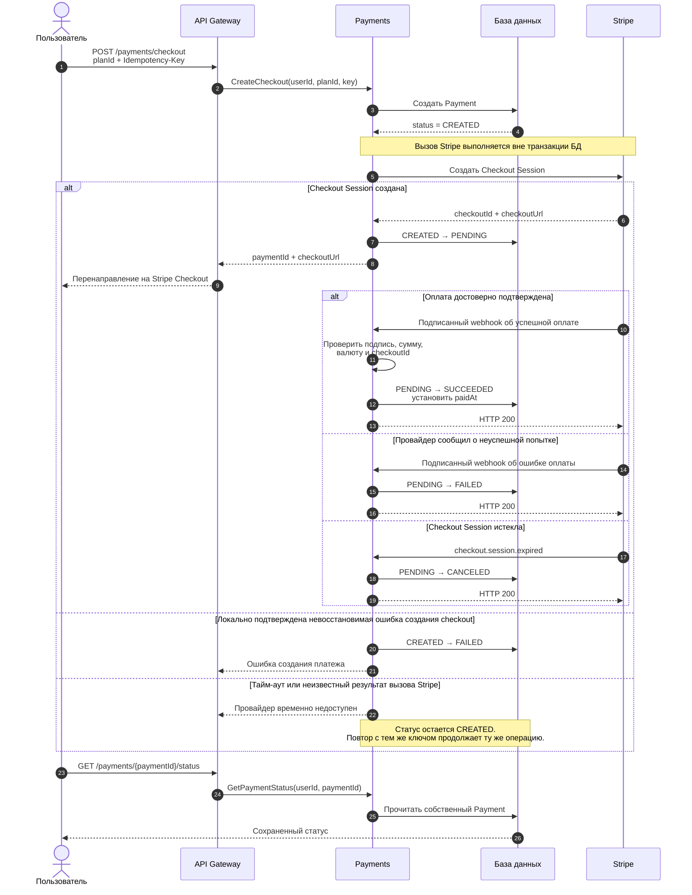

# Машина состояний платежа

Документ фиксирует состояния `Payment` и допустимые переходы первой итерации интеграции со Stripe. Статус описывает только финансовую попытку оплаты и не определяет состояние подписки или доступ пользователя к бизнес-функциям.

## Последовательность переходов



## Допустимые переходы

| Исходный статус | Новый статус  | Инициатор           | Значение                                                                                              |
| --------------- | ------------- | ------------------- | ----------------------------------------------------------------------------------------------------- |
| —               | `CREATED`     | Payments            | Локальная запись создана до обращения к провайдеру.                                                   |
| `CREATED`       | `PENDING`     | Ответ Stripe API    | Checkout Session создана, ожидается достоверный результат оплаты.                                     |
| `CREATED`       | `FAILED`      | Payments            | Зарезервировано для однозначной невосстановимой ошибки создания checkout. Тайм-аут сюда не относится. |
| `PENDING`       | `SUCCEEDED`   | Проверенный webhook | Stripe подтвердил оплату; обязательно устанавливается `paidAt`.                                       |
| `PENDING`       | `FAILED`      | Проверенный webhook | Провайдер достоверно сообщил о неуспешной попытке.                                                    |
| `PENDING`       | `CANCELED`    | Проверенный webhook | Checkout Session истекла или была окончательно отменена.                                              |
| Любой           | Тот же статус | Повторная обработка | Идемпотентный no-op, состояние не изменяется.                                                         |

## Терминальные состояния

`SUCCEEDED`, `FAILED` и `CANCELED` являются терминальными. Переходы из них в другой статус запрещены.

- `SUCCEEDED` нельзя откатить из-за позднего или повторного события.
- Новая попытка после `FAILED` или `CANCELED` должна быть отдельным `Payment` с новым ключом идемпотентности.
- Возвраты и споры в этой итерации отсутствуют. В будущем они должны моделироваться отдельными финансовыми операциями, а не переписыванием успешного платежа в `FAILED`.

## Правила обработки событий

1. Перенаправление на `successUrl` не изменяет статус.
2. До перехода в терминальный статус webhook проверяется по исходному raw body и `Stripe-Signature`.
3. Сумма, валюта и `providerCheckoutId` должны совпасть с локальным платежом.
4. `providerEventId` уникален: повторная доставка одного события не создает новый переход.
5. Событие и изменение платежа сохраняются в одной транзакции.
6. Неизвестное событие, несовпадение реквизитов или запрещенный переход фиксируются, но не изменяют Payment.
7. Тайм-аут внешнего API означает неизвестный результат, а не доказанный `FAILED`.

## Переходы, запрещенные первой итерацией

```text
CREATED → SUCCEEDED
CREATED → CANCELED
PENDING → CREATED
SUCCEEDED → PENDING | FAILED | CANCELED
FAILED → CREATED | PENDING | SUCCEEDED | CANCELED
CANCELED → CREATED | PENDING | SUCCEEDED | FAILED
```

Прямой переход `CREATED → SUCCEEDED` запрещен намеренно: перед успешной оплатой система должна сохранить идентификатор созданной Checkout Session и перейти в `PENDING`.
