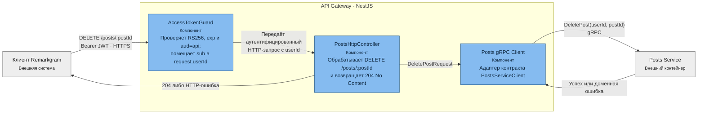

# API Gateway при удалении поста — C4 Component

**Уровень:** C4 Level 3 — Component  
**Контейнер:** API Gateway  
**Родительская диаграмма:** [C4 Container](../container/post-deletion.md)

## Граница ответственности

- API Gateway аутентифицирует запрос, преобразует HTTP-вход в gRPC-контракт и отображает результат
  обратно в HTTP.
- Проверка владельца и изменение данных выполняются не здесь, а в Posts Service.
- User Accounts во время запроса не вызывается: access-токен проверяется локально публичным ключом.

