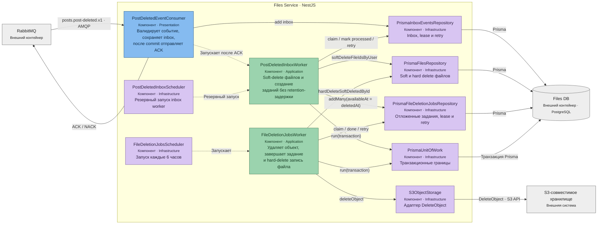

# Files Service при удалении поста — C4 Component

**Уровень:** C4 Level 3 — Component  
**Контейнер:** Files Service  
**Родительская диаграмма:** [C4 Container](../container/post-deletion.md)

## Две стадии удаления файлов

1. Inbox worker транзакционно помечает записи файлов удалёнными, создаёт отложенные задания и завершает
   inbox-событие.
2. Задание доступно сразу после soft delete. Планировщик запускается каждые 6 часов; deletion worker
   идемпотентно удаляет объект из S3, а затем завершает задание и физически удаляет запись файла в
   транзакции с проверкой lease. При ошибках фактическое удаление откладывается до успешной попытки.
