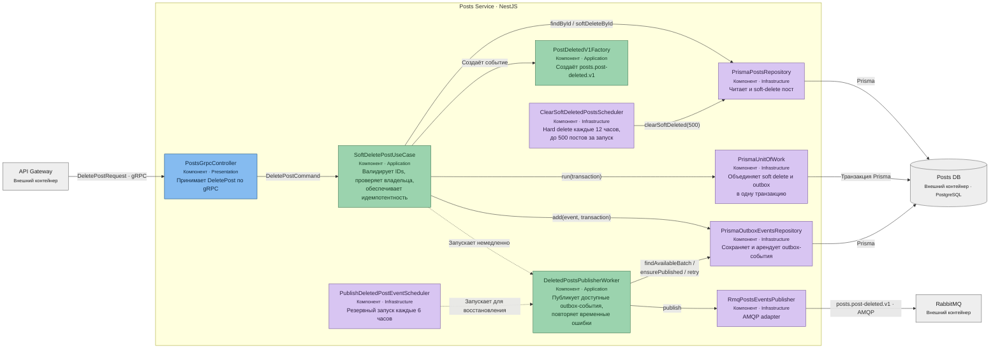

# Posts Service при удалении поста — C4 Component

**Уровень:** C4 Level 3 — Component  
**Контейнер:** Posts Service  
**Родительская диаграмма:** [C4 Container](../container/post-deletion.md)

## Ключевая гарантия

Soft delete поста и сохранение интеграционного события выполняются в одной транзакции. HTTP/gRPC-ответ
не зависит от успешной публикации в RabbitMQ: событие остаётся в outbox и будет обработано повторно.

Физическая очистка не имеет отдельного retention-периода: каждые 12 часов удаляется пакет до 500
soft-deleted постов. Из-за ограничения пакета и повторных попыток фактический срок может превышать
12 часов.
