# Удаление поста — C4 Container

**Уровень:** C4 Level 2 — Container  
**Родительская диаграмма:** [C4 System Context](../system-context/post-deletion.md)

Диаграмма раскрывает четыре приложения Remarkgram и инфраструктурные контейнеры, связанные
с удалением поста. Синим показан активный путь запроса и последующей фоновой обработки.
User Accounts входит в границу системы, но непосредственно в сценарии удаления не вызывается:
API Gateway проверяет подпись access-токена локально с помощью публичного ключа.

```mermaid
flowchart LR
    User["Аутентифицированный пользователь<br/><small>Человек</small>"]
    Client["Клиент Remarkgram<br/><small>Внешняя система</small><br/>Web / Mobile"]

    subgraph Remarkgram["Remarkgram Backend — граница программной системы"]
        direction LR

        Gateway["API Gateway<br/><small>Контейнер · NestJS</small><br/>HTTP API, проверка JWT,<br/>маршрутизация запросов"]
        Posts["Posts Service<br/><small>Контейнер · NestJS</small><br/>Владение постами, soft delete,<br/>публикация событий"]
        Files["Files Service<br/><small>Контейнер · NestJS</small><br/>Учёт файлов, задания удаления,<br/>физическое удаление"]
        Accounts["User Accounts Service<br/><small>Контейнер · NestJS</small><br/>Пользователи, аутентификация,<br/>сессии и выпуск токенов"]

        PostsDB[("Posts DB<br/><small>Контейнер · PostgreSQL</small><br/>Posts, PostImage, OutboxEvent")]
        FilesDB[("Files DB<br/><small>Контейнер · PostgreSQL</small><br/>File, InboxEvent,<br/>FileDeletionJob")]
        AccountsDB[("User Accounts DB<br/><small>Контейнер · PostgreSQL</small><br/>Пользователи и сессии")]
        Broker["Message Broker<br/><small>Контейнер · RabbitMQ</small><br/>События posts.post-deleted.v1"]

        Gateway -->|"DeletePost(userId, postId)<br/>gRPC"| Posts
        Posts -->|"Soft delete + outbox<br/>транзакционно"| PostsDB
        Posts -->|"Публикует событие<br/>AMQP"| Broker
        Broker -->|"Доставляет событие<br/>AMQP"| Files
        Files -->|"Inbox + soft delete +<br/>задание без retention-задержки"| FilesDB

        Gateway -.->|"Другие auth/account-сценарии<br/>gRPC; не вызывается при удалении"| Accounts
        Accounts -->|"Читает и изменяет"| AccountsDB
    end

    Storage["S3-совместимое хранилище<br/><small>Внешняя система</small><br/>Медиафайлы постов"]

    User -->|"Удаляет свой пост"| Client
    Client -->|"DELETE /posts/:postId<br/>HTTPS + Bearer JWT"| Gateway
    Gateway -->|"204 No Content"| Client
    Files -->|"DeleteObject; проверка заданий<br/>каждые 6 часов · S3 API"| Storage

    classDef person fill:#fff3cd,stroke:#8a6d3b,color:#2f250d
    classDef external fill:#eeeeee,stroke:#666666,color:#1f1f1f
    classDef active fill:#1168bd,stroke:#0b4884,color:#ffffff
    classDef datastore fill:#438dd5,stroke:#0b4884,color:#ffffff
    classDef inactive fill:#d9e2ea,stroke:#75808a,color:#26323b

    class User person
    class Client,Storage external
    class Gateway,Posts,Files,Broker active
    class PostsDB,FilesDB datastore
    class Accounts,AccountsDB inactive
```

## Контейнеры приложений

| Контейнер | Роль в сценарии удаления |
| --- | --- |
| API Gateway | Проверяет access-токен, принимает HTTP-запрос и вызывает Posts Service по gRPC. |
| Posts Service | Проверяет владельца, выполняет soft delete поста и сохраняет событие в outbox. |
| Files Service | Принимает событие через inbox, помечает файлы удалёнными и сразу делает задания физического удаления доступными для воркера. |
| User Accounts Service | В текущем запросе не участвует; ранее выпускает токен, проверяемый API Gateway локально. |

## Уровень ниже

Компоненты участвующих приложений раскрыты на отдельных диаграммах:

1. [API Gateway](../component/api-gateway-post-deletion.md) — JWT guard, HTTP controller и gRPC client.
2. [Posts Service](../component/posts-service-post-deletion.md) — gRPC controller, command handler,
   репозитории, Unit of Work, outbox и publisher worker.
3. [Files Service](../component/files-service-post-deletion.md) — consumer, inbox worker, deletion jobs
   worker, репозитории и S3 adapter.

User Accounts не вызывается в этом сценарии, поэтому для него Component Diagram удаления не требуется.

Временной порядок взаимодействий показан на
[Sequence Diagram удаления поста](../../sequences/post-deletion.md).
