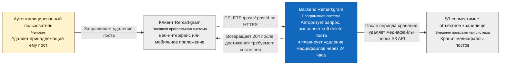

# Удаление поста — C4 System Context

**Уровень:** C4 Level 1 — System Context  
**Область:** удаление поста, принадлежащего аутентифицированному пользователю Remarkgram

На этой диаграмме весь backend Remarkgram намеренно представлен как единая программная система.
API Gateway, Posts, Files, PostgreSQL, RabbitMQ, механизмы outbox/inbox, воркеры и планировщики являются
внутренними деталями. Они должны быть показаны на будущей диаграмме уровня Container.

## Ответственность системы на этом уровне

- Пользователь может удалить только принадлежащий ему пост.
- Повторное удаление идемпотентно: отсутствующий или уже удалённый пост считается находящимся
  в требуемом состоянии.
- Remarkgram подтверждает выполнение HTTP-запроса независимо от последующего физического удаления
  медиафайлов.
- Связанные с постом медиафайлы хранятся ещё 24 часа, после чего Remarkgram удаляет их из объектного
  хранилища.

Порядок выполнения этих действий показан на отдельной
[диаграмме последовательности удаления поста](../../sequences/post-deletion.md).
Внутреннее устройство Remarkgram раскрыто на
[C4 Container Diagram удаления поста](../container/post-deletion.md).

## Границы диаграммы

- Аутентификация является предусловием сценария и не рассматривается здесь как отдельное взаимодействие.
- Диаграмма описывает реализованное поведение backend. Репозиторий конкретного frontend-приложения
  отсутствует в текущем рабочем пространстве, поэтому клиент представлен как внешняя система.
- Гарантии доставки, повторные попытки, транзакционная обработка outbox/inbox и физическое удаление
  намеренно отложены до уровня Container.
