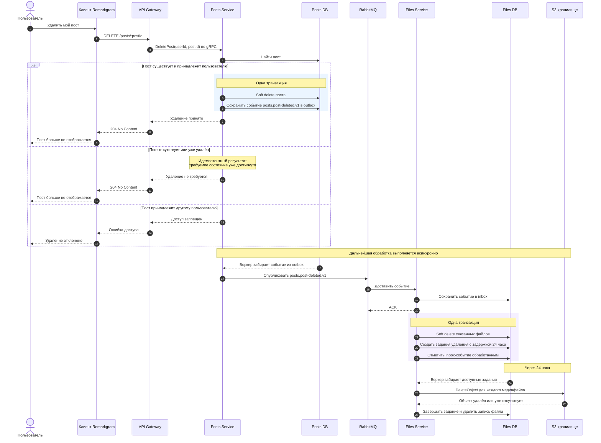

# Удаление поста и медиафайлов — Sequence Diagram

Диаграмма дополняет [C4 System Context](../c4/system-context/post-deletion.md) и показывает динамику
сценария: где заканчивается синхронный HTTP-запрос и как после него продолжается асинхронное удаление.

## Как читать диаграмму

- Сплошные стрелки обозначают запрос или команду, пунктирные — ответ либо получение работы воркером.
- Ответ `204 No Content` не ожидает физического удаления медиафайлов.
- Outbox и inbox отделяют изменение данных от доставки события и позволяют безопасно повторять
  обработку при временных ошибках.
- Физическое удаление начинается после 24-часового периода хранения. Повторный `DeleteObject`
  считается безопасным.
